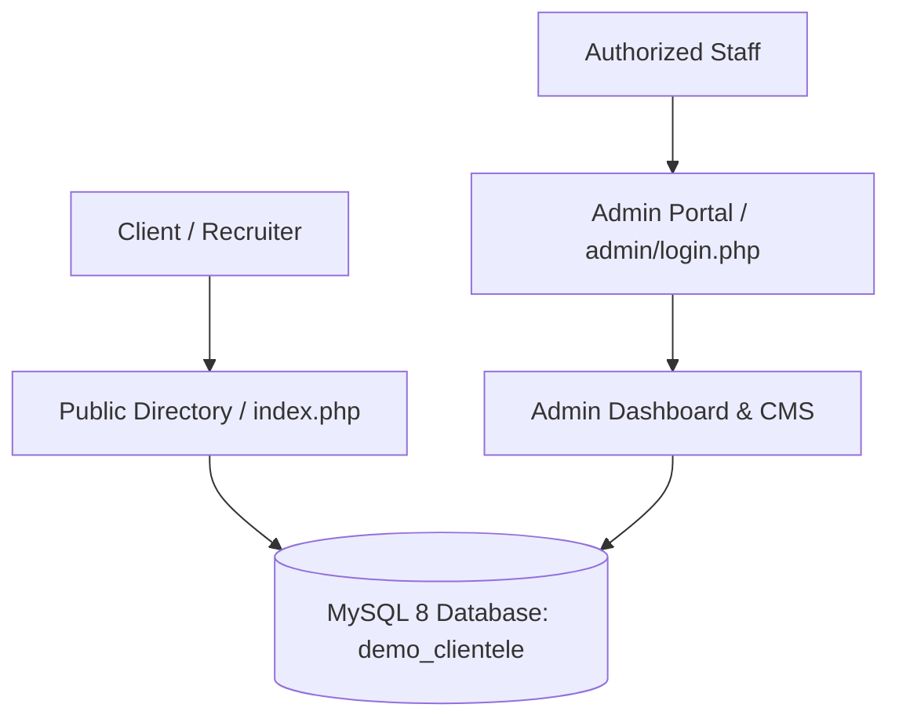

# Clientele Online — B2B Enterprise Client Directory & Showcase

[](https://www.php.net)
[](https://www.mysql.com)
[](#admin-demo-access)
[](#)

An enterprise-grade **Client Brand Directory and Interactive Media Showcase** designed for B2B consultancies, agency holding groups, and enterprise software firms. Provides high-impact brand presentation categorized across 8 major industry verticals, paired with an administrative management portal.

---

## 🌟 Key Capabilities

### 1. Interactive Public Showcase (`index.php`)
- **Industry Vertical Filters**: Seamless tab filtering across Automotive, Banking & Finance (BFSI), Healthcare & Pharma, Technology & SaaS, Retail & FMCG, Media & Entertainment, and Higher Education.
- **Dynamic Brand Cards**: Interactive logos, client case study URLs, metadata badges, and responsive CSS grid layout.
- **Search & Quick Look**: Real-time filtering and category count badges.

### 2. Administrative Control Suite (`/admin/`)
- **Client Management**: Add, update, re-order, or archive client profiles and logos.
- **Category Manager**: Create custom industry domains and assign display priorities.
- **Audit Logging**: Comprehensive action timestamps tracking administrative modifications.
- **Secure Authentication**: Bcrypt password verification and secure session handling.

---

## 🔐 Admin Demo Access

| Account | Username | Password | Role |
| :--- | :--- | :--- | :--- |
| **Super Admin** | `admin` | `Demo@2026!` | Full administrative portal access |
| **Executive** | `swapnil` | `Demo@2026!` | Portfolio management and updates |

---

## 🏗️ System Architecture



### Relational Database Schema
- `clientele_users`: Administrative user profiles and hashed credentials.
- `categories`: Industry taxonomy with slugs and sort orders.
- `clients`: Brand names, category references, website URLs, logo image paths, and active flags.
- `audit_logs`: Detailed activity audit trail.

---

## 🚀 Quick Start & Local Setup (XAMPP / Apache)

### 1. Clone the Repository
```bash
git clone https://github.com/swapnil0607/clientele-system.git clientele
```

### 2. Database Initialization
Create database in MySQL:
```sql
CREATE DATABASE demo_clientele CHARACTER SET utf8mb4 COLLATE utf8mb4_unicode_ci;
```

### 3. Import Schemas & Sanitized Seeds
```bash
mysql -u root demo_clientele < database/schema.sql
mysql -u root demo_clientele < database/seed_dummy.sql
```

### 4. Run Application
- Public Portal: `http://localhost/clientele/`
- Admin Dashboard: `http://localhost/clientele/admin/login.php`

---

## 🛡️ Security & Sanitization Notice
This repository contains **100% synthetic client names and dummy brand placeholders**. All corporate identities, partner lists, and internal references have been completely fictionalized to ensure full NDA compliance and corporate data confidentiality.
